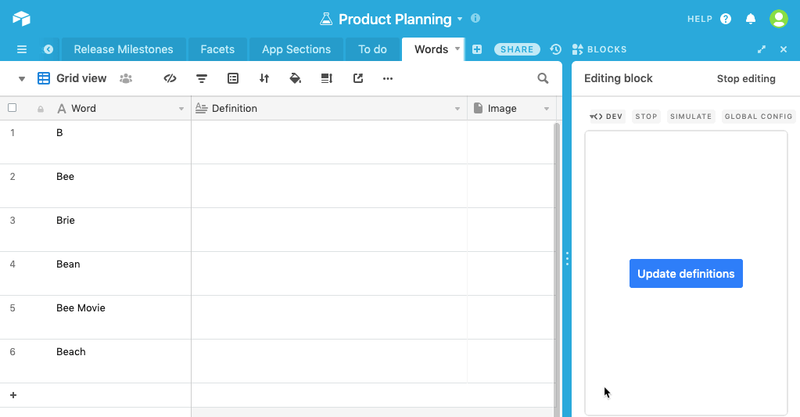

# Wikipedia enrichment app

This example app finds and extracts text and images from Wikipedia for records in your base and saves the
information back to your base.

The code shows:

-   How to connect to an outside API from your app
-   How to update records and upload attachments from your app
-   How to check permissions before updating records

## How to run this app

1. Copy [this base](https://airtable.com/shrBJH7LLUMD6ONIf).

2. Create a new app in your new base (see
   [Create a new app](https://airtable.com/developers/blocks/guides/hello-world-tutorial#create-a-new-app)),
   selecting "Wikipedia enrichment" as your template.

3. From the root of your new app, run `block run`.

## See the app running

